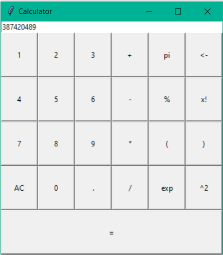

# Python-Tkinter_GUI_Projects
### About Repository 
The graphical user interface (GUI) is a form of user interface that allows users to interact with electronic devices through graphical icons and audio indicator such as primary notation, instead of text-based user interfaces, typed command labels or text navigation.

## Tkinter Programming
Tkinter is the standard GUI library for Python. Python when combined with Tkinter provides a fast and easy way to create GUI applications. Tkinter provides a powerful object-oriented interface to the Tk GUI toolkitThis calculator replicates the operations of the simple calculator and additionally, it helps you to calculate the mod, factorial exponential, and square of the given value

<b>1. Age Calculator:</b> This is simple age calculator which will return you age in the format of <b> "xx year xx months xx days" </b>

<b>2. Calculator:</b> These are the calculator built using Tkinter in Python. This folder contains two different calculator codes.

- <b>Simple Calulator:</b> This calculator replicates the operations of addition, minus, multiplication and division. 

- <b>Advanced Calulator:</b> This calculator replicates the operations of the simple calculator and additionally, it helps you to calculate the mod, factorial exponential, and square of the given value. 

<b>3. Digital Clock:</b> This is a display digital clock that will show time as per the system.

